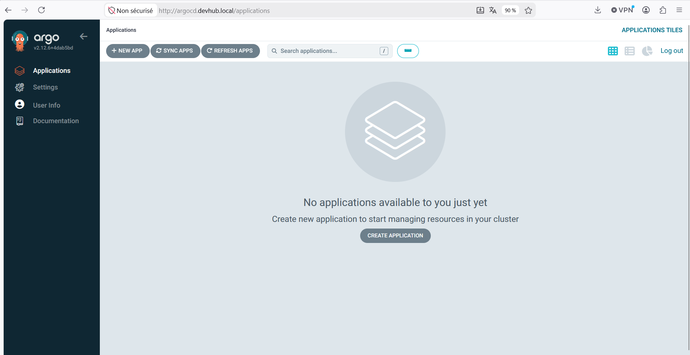
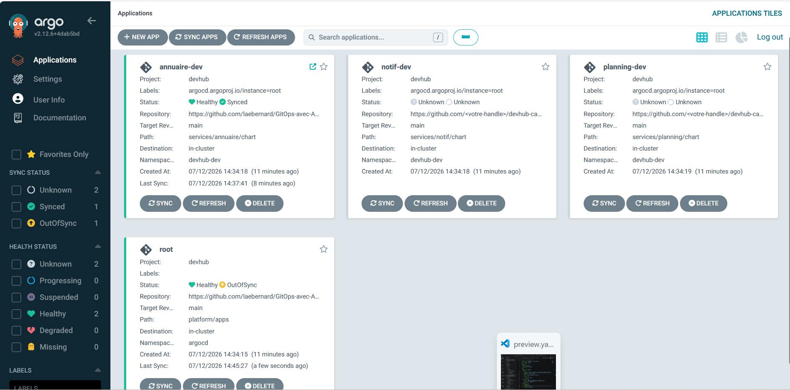

## Étape 0 — Outillage

Environnement : Windows 11 + WSL2 Ubuntu

### Versions des outils installés

**kubectl**
```
Client Version: v1.30.0
Kustomize Version: v5.0.4-0.20230601165947-6ce0bf390ce3
```

**kind**
```
kind version 0.24.0 go1.22.6 linux/amd64
```

**helm**
```
version.BuildInfo{Version:"v3.21.2", GitCommit:"125963406833fe0525be91f46c8b5b0f22fb9e32", GitTreeState:"clean", GoVersion:"go1.26.4"}
```

**argocd**
```
argocd: v2.11.0+d3f33c0
  BuildDate: 2024-05-07T16:21:23Z
  GitCommit: d3f33c00197e7f1d16f2a73ce1aeced464b07175
  GitTreeState: clean
  GoVersion: go1.21.9
  Compiler: gc
  Platform: linux/amd64
```

**git**
```
git version 2.43.0
```

**yq**
```
yq (https://github.com/mikefarah/yq/) version v4.53.3
```

---

## Étape 1 — GitOps en 1 page

### 1. Schéma : Push vs Pull

```
MODELE PUSH - avant (TP 1)
===========================
  Developpeur
      |
      | git push
      v
   GitHub
      |
      | declenche automatiquement
      v
  CI/GitHub Actions -----> kubectl apply -----> Cluster Kubernetes
  (a les droits cluster,                     (la CI entre dedans
   token en secret CI)                        et modifie tout)


MODELE PULL - maintenant - GitOps avec ArgoCD
===============================================
  Developpeur
      |
      | git push
      v
   GitHub
   (source de verite)
      ^
      | lit en continu toutes les 3 min
      |
   ArgoCD controller
   (tourne DANS le cluster, pas en dehors)
      |
      | applique si un ecart est detecte
      v
   Cluster Kubernetes
```

### 2. Tableau comparatif

| Question | Push (kubectl apply en CI) | Pull (ArgoCD) |
|---|---|---|
| Qui a les droits sur le cluster ? | La CI (GitHub Actions) via un token secret | ArgoCD lui-même, il tourne dans le cluster |
| Où est l'historique des changements ? | Logs de la CI + git log | git log du repo — chaque commit = un état du cluster |
| Que se passe-t-il si un dev modifie le cluster à la main ? | Personne ne le sait, la dérive est silencieuse | ArgoCD détecte l'écart et repasse en OutOfSync |
| Comment ajouter un environnement de plus ? | Copier les fichiers YAML, modifier la CI | Ajouter un fichier Application dans platform/apps/ |
| Comment faire un rollback ? | Relancer la CI sur l'ancien commit | git revert → ArgoCD re-converge automatiquement |
| Combien de pipelines pour 30 services ? | 30 pipelines à maintenir | 1 seul contrôleur ArgoCD pour tout |
| Qui voit en direct ce qui tourne ? | Personne sans aller chercher dans les logs | L'UI ArgoCD : état et version visibles d'un coup d'oeil |

### 3. Prise de position personnelle

Pour mes futurs projets perso, je commencerais par le modèle **push** car il est plus simple à mettre en place rapidement sans installer d'outil supplémentaire. Je basculerais vers le modèle **pull** dès que le projet grandit avec plusieurs services ou plusieurs personnes, car le risque de dérive silencieuse et le manque de visibilité deviennent vite problématiques.

---

## Étape 2 — Le vocabulaire d'ArgoCD

### Glossaire personnel

| Terme | Définition | Exemple dans mon projet | À ne pas confondre avec |
|---|---|---|---|
| **Application** | Ressource ArgoCD qui surveille un dossier Git et déploie son contenu dans un namespace Kubernetes. C'est l'unité de base d'ArgoCD. | `annuaire-dev` : surveille `services/annuaire/chart`, branche `main`, déploie dans `devhub-dev` | L'application au sens métier (le code de l'annuaire) ou un Deployment Kubernetes |
| **AppProject** | Périmètre de sécurité qui limite ce qu'une Application peut faire : quels repos Git elle peut lire, dans quels namespaces elle peut déployer. | `devhub` dans `platform/projects/devhub.yaml` : autorise seulement le repo GitHub de laebernard et les namespaces `devhub-*` | Un projet GitHub ou un namespace Kubernetes |
| **Source** | L'origine de la configuration à déployer : URL du repo Git + chemin dans le repo + branche ou tag. | URL `https://github.com/laebernard/GitOps-avec-ArgoCD-.git`, path `services/annuaire/chart`, branche `main` | Juste une URL sans chemin ni branche précisés |
| **Destination** | L'endroit où ArgoCD déploie : un cluster + un namespace cible. | Cluster local (`https://kubernetes.default.svc`) + namespace `devhub-dev` | Un environnement logique (dev/prod) — c'est une adresse technique |
| **Sync** | L'action d'appliquer l'état Git sur le cluster. 3 modes : Manuel (bouton), Auto (ArgoCD déclenche seul), Self-heal (ArgoCD corrige aussi les modifs manuelles). | Dans `annuaire.yaml` : sync manuelle d'abord, puis `selfHeal: true` une fois validée | Un `kubectl apply` — même effet mais déclenché manuellement, hors GitOps |
| **Prune** | Option qui autorise ArgoCD à supprimer du cluster les ressources absentes de Git. | `prune: false` dans notre config — on ne supprime rien automatiquement pour éviter les accidents | `kubectl delete` (suppression manuelle ponctuelle) |
| **App of Apps** | Pattern où une Application racine crée et gère d'autres Applications en lisant un dossier de manifestes. | `root` dans `platform/bootstrap/root-app.yaml` lit `platform/apps/dev/` et crée automatiquement `annuaire-dev` | Un umbrella Helm chart — similaire en concept mais sans ArgoCD |
| **ApplicationSet** | Contrôleur qui génère plusieurs Applications automatiquement à partir d'un template et d'une règle (branches, clusters, PRs...). | Pas encore fait — étape 7 : générera un env de preview par branche `feature/*` | Une App of Apps (statique). ApplicationSet est dynamique. |
| **Sync wave** | Annotation qui ordonne l'application des ressources lors d'une sync. Les waves basses s'appliquent en premier. | Wave `-1` pour un ConfigMap, wave `0` pour le Deployment : la config existe avant que le pod démarre | Un Hook — les waves ordonnent des ressources normales, les hooks sont temporaires |
| **Hook** | Ressource annotée qui s'exécute à un moment précis autour d'une sync : PreSync (avant), Sync (pendant), PostSync (après). ArgoCD la crée et la supprime automatiquement. | Un Job de migration de BDD annoté `PreSync` : il tourne avant que le nouveau Deployment de l'annuaire soit appliqué | Un sync wave — les hooks ont leur propre cycle de vie |

---
---

## Etape 3 - Containeriser annuaire-service

Le Dockerfile se trouve dans services/annuaire/Dockerfile.

Il est compose de 2 stages :

Stage 1 build : part de node:20-alpine, copie package.json et package-lock.json,
installe les dependances avec npm ci --omit=dev, puis copie le code source src/.

Stage 2 runtime : repart d une image node:20-alpine vierge, copie uniquement
node_modules et src/ depuis le stage build, cree un utilisateur non-root appuser
uid 1001 et bascule dessus avec USER 1001.

### Contraintes respectees

| Contrainte | Statut |
|---|---|
| Multi-stage | OK - 2 stages build + runtime |
| Image finale < 200 Mo | OK - 199 Mo |
| Utilisateur non-root | OK - USER 1001 appuser |
| Aucun secret en ENV | OK - seulement PORT LOG_LEVEL NODE_ENV |
| LABEL image.source | OK - pointe vers le repo GitHub |
| Endpoint /healthz | OK - repond 200 avec status ok |
| LOG_LEVEL | OK - debug info warn pris en compte |

### Validation

docker run -p 8081:8080 -e LOG_LEVEL=debug annuaire-service:test
resultat : annuaire up on 8080 + log debug affiché

curl http://localhost:8081/healthz
resultat : ok true service annuaire

### Image publiee sur GHCR


ghcr.io/laebernard/annuaire-service:e31ef74
digest: sha256:ac680ca4273feb725b7d0c4b94dcf2a89e4b4d316d320f55115a22c3c1851e07


---

## Etape 4 - Chart Helm de annuaire-service

Le chart se trouve dans devhub-campus/services/annuaire/chart/

Structure du chart :
- Chart.yaml : metadonnees du chart (nom, version, description)
- values.yaml : valeurs par defaut
- values-dev.yaml : surcharges pour dev (ingress active, LOG_LEVEL=debug)
- values-staging.yaml : surcharges pour staging (2 repliques)
- values-preview.yaml : surcharges pour preview (1 replique, ressources reduites)
- templates/_helpers.tpl : labels communs
- templates/deployment.yaml : deploiement avec probes et securityContext
- templates/service.yaml : service ClusterIP
- templates/ingress.yaml : ingress conditionnel

Labels obligatoires sur chaque ressource :
- app.kubernetes.io/name
- app.kubernetes.io/instance
- app.kubernetes.io/part-of: devhub-campus
- app.kubernetes.io/managed-by: Helm

Probes configurees sur /healthz :
- readinessProbe : initialDelaySeconds 2, periodSeconds 5
- livenessProbe : initialDelaySeconds 10, periodSeconds 10

Image utilisee : ghcr.io/laebernard/annuaire-service:e31ef74
Utilisateur non-root : runAsUser 1001 (aligne avec le Dockerfile)

### Validation

helm lint chart/
resultat : 1 chart linted, 0 chart failed

helm template chart/ -f chart/values-dev.yaml | kubectl apply --dry-run=client -f -
resultat :
service/release-name-annuaire created (dry run)
deployment.apps/release-name-annuaire created (dry run)
ingress.networking.k8s.io/release-name-annuaire created (dry run)


---

## Etape 5 -  Installer ArgoCD et déclarer la première Application

### Capture d’écran de l’Application Healthy et Synced



### Comparaison entre selfHeal: true et prune: true

#### selfHeal: true

Objectif :
ArgoCD surveille en continu l’état du cluster.
Si quelqu’un modifie une ressource à la main (kubectl edit, kubectl scale…), ArgoCD remet immédiatement la ressource dans l’état Git.

Exemple :
Un développeur augmente temporairement les replicas pour débugger :

Conséquence :
   ArgoCD détecte le drift (cluster modifier manuellement) -> ArgoCD remet les replicas à la valeur Git -> Le développeur perd son test en cours

Danger : rollback automatique non désiré.

#### prune: true

Objectif:
Si un fichier YAML est supprimé du repo, ArgoCD supprime automatiquement la ressource correspondante dans le cluster.

Exemple :
Un membre de l’équipe supprime par erreur

Conséquence :
  ArgoCD voit que le Deployment n’existe plus dans Git -> ArgoCD le supprime -> service annuaire tombe

Danger : possibilité de supprimer des resspurces involontairement.


---

## Etape 6 - Le pattern App of Apps

## Pourquoi le pattern App of Apps n’est-il pas équivalent à une simple kubectl apply -f apps/dev/ ?

### kubectl apply

```sh
kubectl apply -f apps/dev/
```

la commande kubectl apply permet un déploiement immédiat mais :

 - pas de suivi
 - pas de correction automatique
 - pas de gestion du drift (cluster modifier manuellement)
 - pas de rollback
 - pas d'historique GitOps

Une fois les manifests appliqués :

- Kubernetes ne vérifie plus si le cluster correspond au Git.
- Si quelqu’un modifie une ressource à la main, le cluster diverge.
- Si un fichier est supprimé dans Git, Kubernetes ne supprime rien.
- Si un fichier change dans Git, Kubernetes ne met rien à jour.

### App of Apps

Le pattern App of Apps lit le dossier en continu et permet :

 - synchronisation automatique des applications enfants
 - prune (si suppression d'un fichier dans git = ArgoCD supprime la ressource)
 - vérification des erreurs
 - rollback
 - historique GitOps
 - sécurité avec gestion des autorisations

### Conclusion
| kubectl apply              | App of Apps                 |
|----------------------------|-----------------------------|
| Déploiement ponctuel       | Déploiement continu         |
| Pas de drift correction    | Self-heal                   |
| Pas de prune               | Prune automatique           |
| Pas de sécurité            | AppProject                  |
| Pas de rollback            | Historique + rollback       |
| Pas de supervision         | Health checks               |
| Pas de GitOps              | Git = source de vérité      |


### Capture d’écran de l’Application Healthy et Synced

